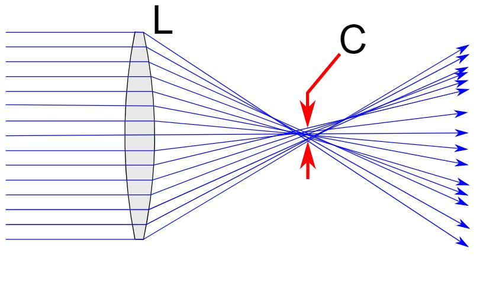
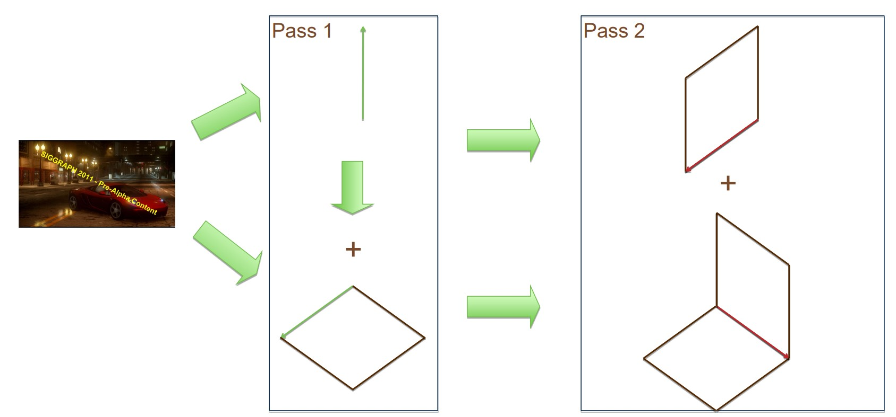
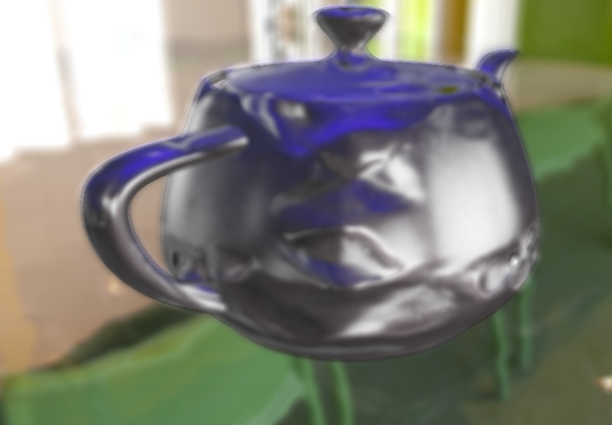
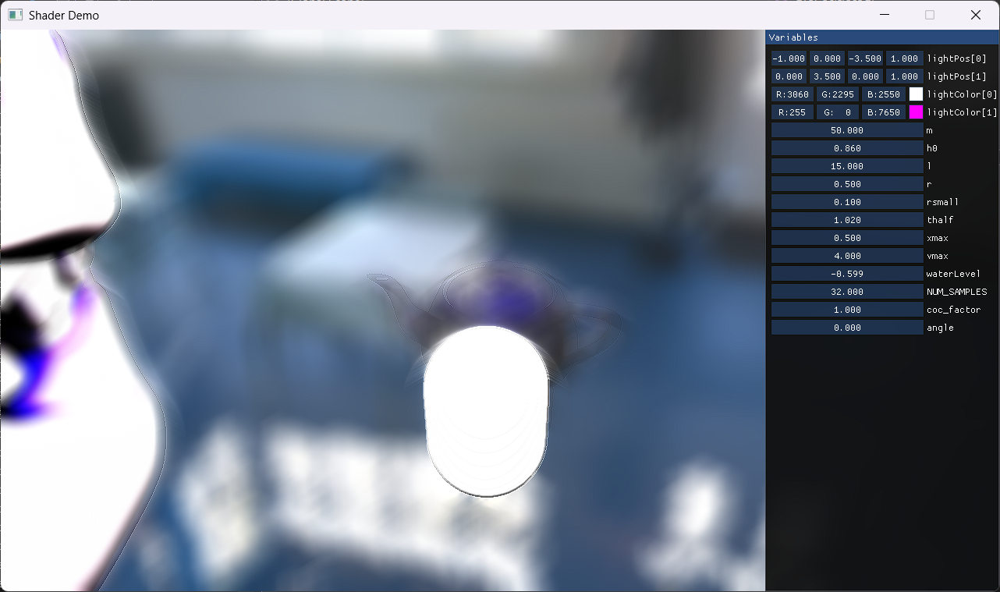
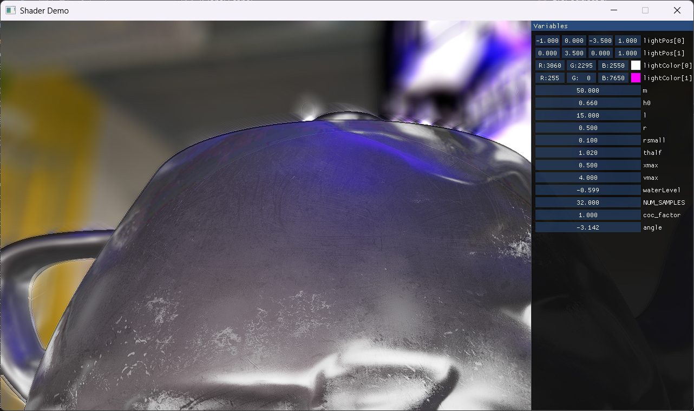

# Bokeh Effect
Hexagonal Bokeh Blur

# Introduction

Bokeh (Japanese: boke -- blur) in photography refers to the way out-of-focus objects appear due to the lens's optical properties. It's a type of blur resulting from lens aberrations. This effect was implemented as part of the Advanced Computer Graphics Techniques course. The algorithm developed consists of two parts: calculating the Circle of Confusion (CoC) and blurring the rendered image according to the size of the calculated CoC.

# Circle of Confusion

In optics, the Circle of Confusion (CoC) is an optical spot caused by a cone of light rays from a lens that does not perfectly focus when projecting a point source onto a sensor. The formation of the CoC is shown in Figure 1. The size of the CoC depends on the focus setting of the lens and the distance of the projected object.

*Figure 1: Formation of Circle of Confusion*

In the developed software, the CoC is calculated based on distance (in screen space), with focus set on objects where \(z \leq 0.5\). For farther objects, the size of the CoC is proportional to \(z^4\). During the blurring process, the CoC values from neighboring pixels are first reduced. Then, the CoC value is enhanced for the target pixel, resulting in smoother transitions between colors. Additionally, if the CoC value for a given pixel is zero, the image is not blurred.

# Bokeh Effect

The implementation of the Bokeh effect uses hexagonal blurring, which is as effective as Gaussian blurring because it only requires two rendering passes to achieve the final effect. In the first pass, the image is blurred vertically and stored in the first texture, while it is blurred both vertically and diagonally and stored in the second texture. In the second pass, the images from both textures are blurred diagonally, so that the final blurring area forms a hexagon. The process of creating this blur effect is shown in Figure 2.

*Figure 2: Two-pass process of creating the Bokeh effect*

The implemented algorithm consists of three blurring rhombuses. To prevent the edges of adjacent rhombuses from artificially enhancing color, the brightness of colors was halved during the blurring process since each of these edges is blurred twice.

Additionally, the algorithm allows for defining the rotation of the resulting CoC in the shape of hexagons.

# Conclusion

Compared to Gaussian blur, the Bokeh effect can produce more interesting visual results not only by manipulating CoC values but also by changing the shape of the blur through different sampling angles. The current implementation introduces unwanted artifacts on the edges of objects with low CoC, as seen in Figures 3 and 4.

*Figure 3: Bokeh blur*

*Figure 4: Blur of a white spot*

*Figure 5: Blur for an object close to the camera*